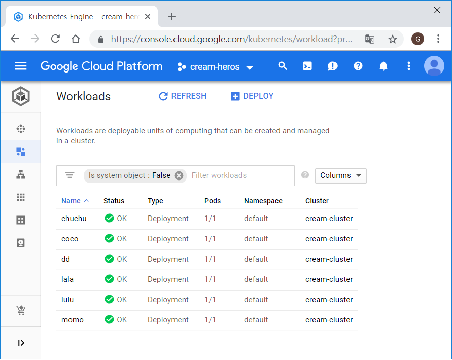
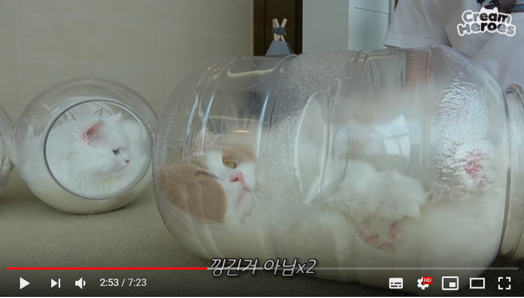
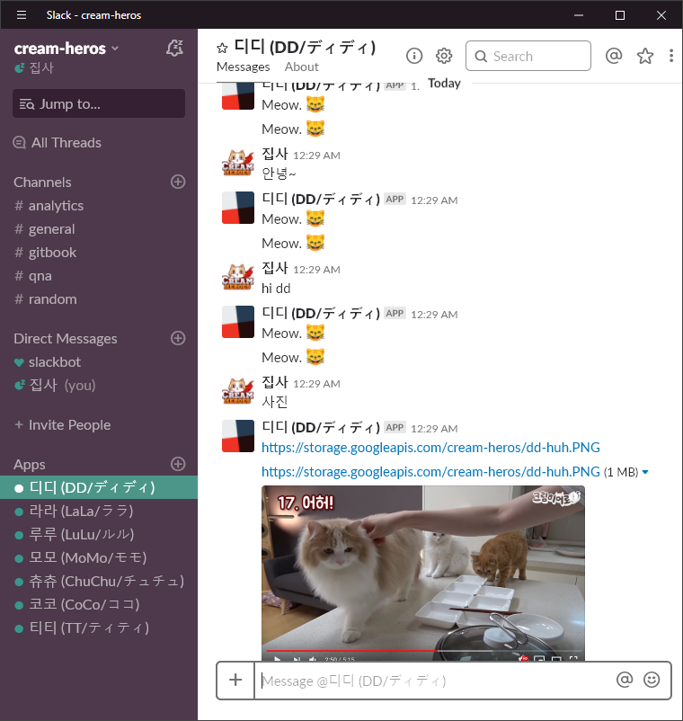
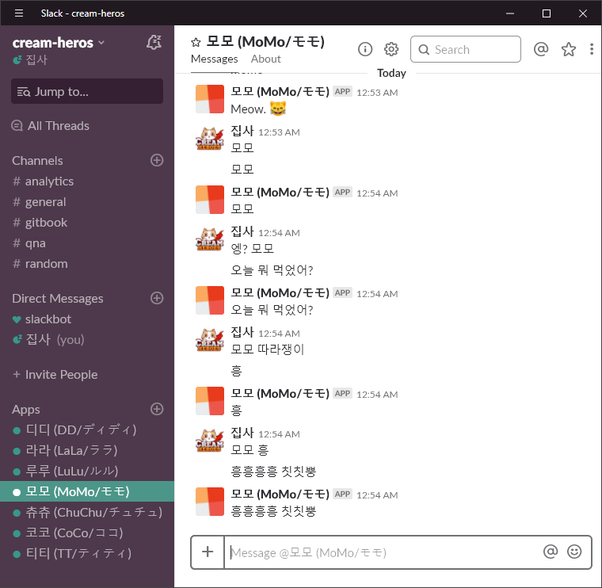
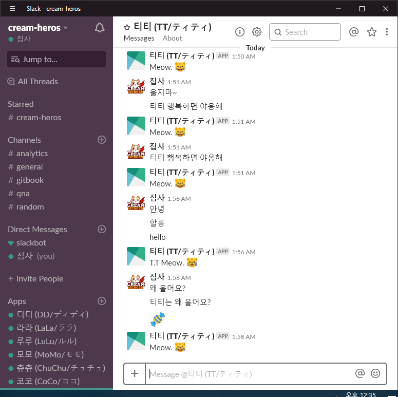
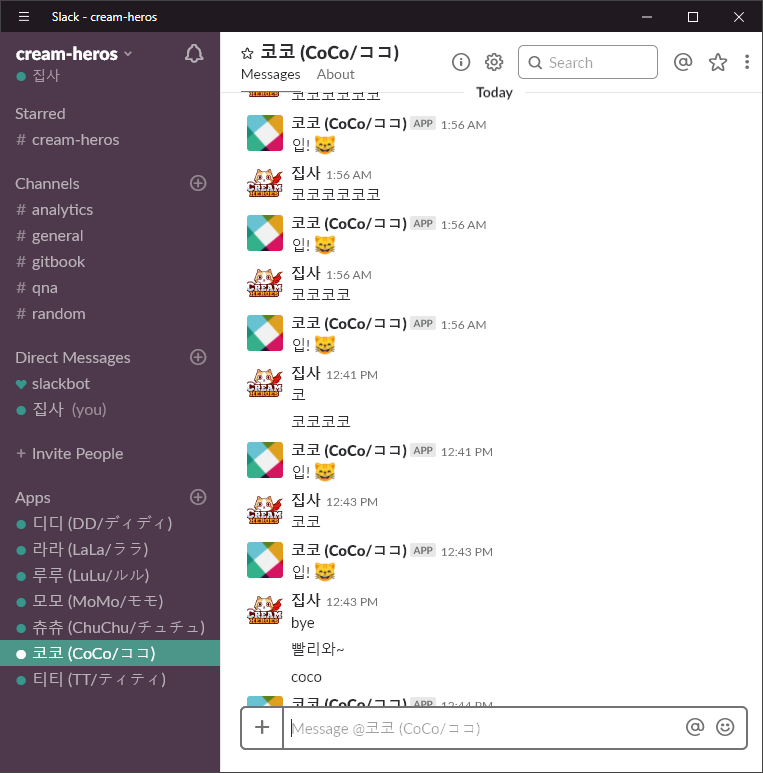

# 쿠버네티스로 칠냥이 도커 컨테이너에서 키우기

## 오마쥬 크림 히어로즈

여기서 소개할 내용은 [QwikLab - Build a Slack Bot with Node.js on Kubernetes](https://qwiklabs.com/focuses/635?parent=catalog)에서 소개하고 있는 [Google Codelab](https://github.com/googlecodelabs/cloud-slack-bot.git)을 응용한 것으로 고양이 슬랙봇 일곱 마리를 도커 컨테이너에 담아 키워보는 토이 프로젝트 입니다. 원본 kitten bot 예제 코드에서는 새끼 고양이 한 마리만 등장하지만 고양이가 외로울 수 있기 때문에 유명한 유튜브 채널인 [크림 히어로즈](https://www.youtube.com/channel/UCmLiSrat4HW2k07ahKEJo4w)에서 처럼 행복한 일곱 냥이를 키워보고 싶었습니다. 

설명에 사용한 전체 소스코드는 [https://github.com/goungoun/cream-heros](https://github.com/goungoun/cream-heros) 에서 받으실 수 있고 [https://join.slack.com/t/cream-heros/signup](https://join.slack.com/t/cream-heros/signup) 에 G-mail로 join하셔서 냥이와 대화해볼 수 있습니다.

## 고양이 파악하기

먼저 kitten bot에 고양이의 특징을 반영하기 위해 냥이들의 특징을 분석해봅니다. 봇에 기능을 추가해보면서 쿠버네티스를 어떻게 운영할 수 있는지 알아가보려고 합니다.

* hi 라고 인사하면 모든 고양이가 meow라고 인사해줍니다.
* dd 라고 부르면 고양이 디디가 자기 이름인 것을 알아듣고 meow라고 인사해줍니다.
* tt 라고 부르면 티티가 달려와서 meow라고 인사해줍니다.
* 털뚠뚠이 디디는 밥먹으라고 하면 늦게오고 꼭 딴청을 피웁니다.
* 루루는 가끔 똑똑합니다.
* 라라는 해적이에요~
* 고양이들은 공간이 좁으면 잘 싸웁니다. 하지만 크림히어로즈 집사처럼 여유로운 환경을 제공해주면 잘 지내기도 합니다.

## 클라우드 챌린지

* 티티,디디,코코,모모,츄츄,라라를 어떻게 컨테이너에 태울 것인가?
* pod는 어떻게 구성해야하나?
* 냥이 시간 맞춰 재우기/깨우기/밥주기

## 슬랙 채널 만들기

크림 히어로즈 집사가 모시고 있는 고양이는 총 7마리 입니다. 이름은 [나무 위키-크림 히어로즈](https://namu.wiki/w/크림히어로즈)에 소개된 내용 그대로 사용하겠습니다.

> 디디 \(DD/ディディ\) @dd 티티 \(TT/ティティ\) @tt 코코 \(CoCo/ココ\) @coco 모모 \(MoMo/モモ\) @momo 츄츄 \(ChuChu/チュチュ\) @chuchu 루루 \(LuLu/ルル\) @lulu 라라 \(LaLa/ララ\) @lala

귀여운 냥이들과 대화하기 위해서는 내 슬랙 채널을 하나 만들어서 모셔와야 합니다. 봇 일곱개를 만들어 설치하고 토큰 일곱개를 미리 잘 챙겨둡니다. 토큰이 저장된 개별 파일 또는 디렉토리는 .gitignore에 등록하셔서 토큰이 유출되지 않도록 해 주세요. 내 토큰은 소중하니까요.

```bash
$ mkdir secret
$ echo "[슬랙 토큰 문자열]" > dd-token
```

## 버켓에 고양이 사진 올리기

Storage &gt; bucket을 생성하여 고양이 사진을 올려줍니다. 이 사진은 채팅창에 '사진' 이라고 입력하면 사진을 보여주는 용도로 사용할 것입니다.  
  
올린 사진을 외부에 오픈하기 위해서는 권한 수정에서 allUsers 그룹을 만들어서 읽기 권한을 줍니다.

```text
Entity: Group
Name: allUsers
Access: Reader
```

이 작업을 해 주어야 이렇게 외부에서 접근 가능한 짧은 URL이 제공됩니다. [https://storage.googleapis.com/cream-heros/container\_capsule.png](https://storage.googleapis.com/cream-heros/container_capsule.png)

구글 클라우드에 처음 사진을 올리시는 분은 [Extract, Analyze, and Translate Text from Images with the Cloud ML APIs ](https://qwiklabs.com/focuses/1836?parent=catalog)에 Upload an image to a cloud storage bucket을 참고하시면 됩니다.

## 코드 준비

[Google Codelab](https://github.com/googlecodelabs/cloud-slack-bot.git)은 매우 섬세한 예제를 담고 있습니다. 토큰을 소스코드에 넣지 않고 환경변수를 받아서 사용하고 있기 때문에 그냥 Copy & Paste하는 방법으로 칠냥이를 만들 수는 없습니다. node 명령어로 스크립트를 실행시킬 때는 이렇게 환경변수를 넘겨서 테스트를 해 주어야 합니다.

```text
$ DD_TOKEN_PATH=./secret/dd-token node ./dd/dd.js
```

칠냥이를 각각의 컨테이너에 태울 때도 쿠버네티스에 배포할 때도 칠냥이의 각 이름과 설정을 여기 저기 고쳐줘야 합니다. 코딩, 도커라이징, 쿠버네티스 클러스터 배포 3단계에서 이 까다로운 챌린지를 쉬운 것처럼 느껴지게 할 어떤 도구의 필요성이 느껴지더군요.

### 1단계 : 코딩

[copycat.sh](https://github.com/goungoun/cream-heros/tree/6eaee31c9cf5bb3181508a513377e5e7d772e2f3/copycat.sh) 을 실행시켜 7냥이를 일단 똑같이 만들어줍니다. 나중에 각 고양이의 캐릭터를 살릴 수 있는 세부적인 코딩이 들어갑니다.

```bash
$ git clone https://github.com/goungoun/cream-heros.git
$ chmod +x ./copycat.sh
$ ./copycat.sh dd tt coco momo chuchu lulu lala
```

package.json은 npm init으로 만들수도 있지만 여기서는 그냥 복사한 것을 사용하겠습니다.

```bash
$ npm init
$ npm install --save botkit
```

### 2단계: 도커라이징

[docker.sh](https://github.com/goungoun/cream-heros/tree/6eaee31c9cf5bb3181508a513377e5e7d772e2f3/docker.sh) 냥이를 도커 컨테이너에 태우기 위해 꼭 필요한 도커 명령어를 하나로 묶어놓았습니다.  
셸을 실행시킨 후에는 Container Registry 메뉴에서 확인할 수 있습니다.

```bash
$ docker build -t gcr.io/cream-heros/dd:v1 .
$ docker images
$ docker push gcr.io/cream-heros/dd:v1
```

혹시라도 잘못 만들어서 이미지 삭제가 필요할 때는 docker rmi로 삭제할 수 있습니다.

```text
$ docker rmi ${IMAGE_ID}
```

도커 레지스트리에 올리기 전에 테스트를 미리 해 보고 싶다면 현재 디렉토리에 있는 토큰 파일을 도커와 volume과 연결시켜주어야 합니다. 아래 명령어는 현재 디렉토리의 dd-token를 도커가 읽어갈 수 있도록 volume을 매핑해주고 도커 내 환경변수에 토큰 파일을 설정하여주는 예제입니다.

```bash
$ docker run -d \
   -v $(pwd)/secret/:/secret \
   -e DD_TOKEN_PATH=/secret/dd-token \
   gcr.io/cream-heros/dd:v1
$ docker ps
$ docker stop ${CONTAINER ID}
```

### 3단계: 쿠버네티스 배포

[kubectl.sh](https://github.com/goungoun/cream-heros/tree/6eaee31c9cf5bb3181508a513377e5e7d772e2f3/kubectl.sh) 냥이 컨테이너를 생성하고 운영하는데 꼭 필요한 쿠버네티스 명령어 모음입니다. 쿠버네티스 명령어가 익숙해진 다음에 간편하게 사용할 생각으로 만들었습니다.

## 슬랙 토큰

Kubernetes &gt; 구성 메뉴로 들어가면 비밀번호, 키, 토큰과 같은 민감한 정보를 저장할 수 있는 공간이 있습니다. 슬랙 토큰은 소스코드에 기록하게되면 유출의 염려가 있기 때문에 별도의 파일에 기록한 다음 쿠버네티스 클러스터에 적용해줍니다. 토큰의 이름은 \_를 사용할 수 없는 것에 유의해주세요.

```bash
$ kubectl create secret generic dd-token --from-file=./secret/dd-token
$ kubectl get secret
NAME                  TYPE                                  DATA      AGE
dd-token              Opaque                                1         2m
default-token-qtqm8   kubernetes.io/service-account-token   3         27m
```

나머지 여섯 냥이의 토큰도 빈 파일을 미리 만들어놓고 코드편집기\(베타\)를 활용해서 넣어줍니다.

```bash
$ touch tt-token momo-token lulu-token lala-token chuchu-token coco-token
```

그리고 kubectl create 명령어를 고양이 수 만큼 일곱 번 실행해주는데 저는 뭔가 잘못 써서 토큰이 바뀌는 바람에 dd를 부르면 tt가 응답하고 tt가 dd로 응답하는 실수를 저질렀네요. 바로 swap하여 고쳐주었습니다.

```text
$ cat dd-token > bak-token
$ cat tt-token > dd-token
$ cat bak-token > tt-token
```

하지만 반복되는 실수가 싫으니까 스크립트도 하나 만들어봅니다. secret 하위 디렉토리의 파일들을 읽어서 시크릿을 등록해주는 스크립트입니다. [./secret.sh](https://github.com/goungoun/cream-heros/tree/514ded7965a0af3583976c19d1911c7c88badc35/secret.sh)을 1회 실행해줍니다. 혹시라도 나중에 클러스터를 삭제했다가 재 생성하는 경우에 이 스크립트를 사용할 수 있습니다.

```bash
#!/bin/bash
for cat in `ls ./secret`;do
  kubectl create secret generic ${cat} --from-file=./secret/${cat}
done

kubectl get secret
```

```bash
$ kubectl get secret
NAME                  TYPE                                  DATA      AGE
chuchu-token          Opaque                                1         15s
coco-token            Opaque                                1         9s
dd-token              Opaque                                1         30m
default-token-bz9c5   kubernetes.io/service-account-token   3         38m
lala-token            Opaque                                1         20s
lulu-token            Opaque                                1         25s
momo-token            Opaque                                1         32s
tt-token              Opaque                                1         45s
```

## 쿠버네티스

Kubernetes Engine &gt; Kubernetes clusters &gt; Create cluster로 만들거나 gcloud container clusters 커맨드로 디디를 위한 클러스터를 만들어줍니다. 노드는 나중에 늘려줄 수 있기 때문에 일곱냥이를 다 태워줄수 있을지 없을지는 고민하지 마세요.

```bash
$ gcloud container clusters create dd-cluster \
      --num-nodes=2 \
      --zone=us-central1-f \
      --machine-type n1-standard-1
$ gcloud compute instances list
```

이렇게 생성한 클러스터는 [Kubernetes doc](https://kubernetes.io/docs/concepts/workloads/controllers/deployment/)을 참고하여 kebectl 명령어로 확인해봅니다.

```bash
$ kubectl get services
$ kubectl get deployments
$ kubectl get rs
$ kubectl get pods
$ kubectl describe deployments
$ kubectl logs ${POD_NAME} ${CONTAINER_NAME}
```

```bash
$ kubectl create -f ./dd/deploy.yaml
```

동일한 tt, momo, lala, chuchu, lulu 도커 이미지도 배포해줍니다. 

혹시라도 배포가 잘못된 경우는 삭제하고 다시 생성해주면 되지요.

```bash
$ kubectl delete -f ./dd/deploy.yaml //yaml 파일이 있을 때
$ kubectl delete deployment dd //yaml 파일이 없을 때 <resource> <name>
```

## POD

쿠버네티스의 POD는 어드민과 네트워킹을 하기 위해 묶어놓은 그룹입니다. 하나 또는 여러개의 컨테이너를 포함할 수 있고 kubectl run 커맨드로 pod를 만들 수 있습니다.

* 털 뚠뚠이 디디가 하나의 컨테이너가 들어가있네요.

  

  ```bash
  $ kubectl create -f ./dd/deploy.yaml
  ```

* 1냥 1 POD - 일곱냥이 모두 컨테이너에 들어가는 것을 좋아합니다. [영상 보러가기 ♡♡](https://www.youtube.com/watch?v=bGvsqQW1XOw)

  

  ```bash
  $ kubectl create -f ./dd/deploy.yaml
  $ kubectl create -f ./tt/deploy.yaml
  $ kubectl create -f ./momo/deploy.yaml
  $ kubectl create -f ./lulu/deploy.yaml
  $ kubectl create -f ./lala/deploy.yaml
  $ kubectl create -f ./coco/deploy.yaml
  $ kubectl create -f ./chuchu/deploy.yaml
  ```

### POD는 안전한가요?

혹시라도 냥이가 다칠까봐 [조대협님의 블로그](http://bcho.tistory.com/1261)에 소개된 리플리케이션 컨트롤러 기능을 테스트 해 보기로 합니다. 이 기능은 POD의 상태를 체크하고 있다가 이상이 있으면 자동으로 재구동해주는 기능이라고 합니다. POD를 강제로 삭제해주면 다시 POD가 올라오는 것을 볼 수 있습니다.

```bash
$ kubectl delete pod --all
pod "chuchu-847c58df5c-klfnd" deleted
pod "coco-6586fd94d9-hp4dz" deleted
pod "dd-759b4499b9-gjqch" deleted
pod "lala-7bc6d65c79-sxltc" deleted
pod "lulu-5b746f57bc-tgh64" deleted
pod "momo-6bc44d84b9-7l2wr" deleted
pod "tt-7566595f89-pr595" deleted
$ kubectl get pods
NAME                      READY     STATUS              RESTARTS   AGE
chuchu-847c58df5c-bsm4j   1/1       Running             0          13s
chuchu-847c58df5c-klfnd   1/1       Terminating         0          2d
coco-6586fd94d9-hp4dz     1/1       Terminating         0          2d
coco-6586fd94d9-v94r2     1/1       Running             0          12s
dd-759b4499b9-gjqch       1/1       Terminating         0          1d
dd-759b4499b9-rz4gb       1/1       Running             0          12s
lala-7bc6d65c79-dx2zg     0/1       ContainerCreating   0          12s
lala-7bc6d65c79-sxltc     1/1       Terminating         0          9h
lulu-5b746f57bc-hp2n7     1/1       Running             0          11s
lulu-5b746f57bc-tgh64     1/1       Terminating         0          8h
momo-6bc44d84b9-7l2wr     1/1       Terminating         0          10h
momo-6bc44d84b9-l6px6     1/1       Running             0          11s
tt-7566595f89-fxxwx       0/1       Pending             0          10s
tt-7566595f89-pr595       1/1       Terminating         0          10h
$ kubectl get pods
NAME                      READY     STATUS    RESTARTS   AGE
chuchu-847c58df5c-bsm4j   1/1       Running   0          1m
coco-6586fd94d9-v94r2     1/1       Running   0          1m
dd-759b4499b9-rz4gb       1/1       Running   0          1m
lala-7bc6d65c79-dx2zg     1/1       Running   0          1m
lulu-5b746f57bc-hp2n7     1/1       Running   0          1m
momo-6bc44d84b9-l6px6     1/1       Running   0          1m
tt-7566595f89-fxxwx       1/1       Running   0          1m
```

그런데 종료가 마무리 되지 않은 상태에서 바로 재구동해주는 약간의 텀 동안 디디에게 말을 걸어보니 순간적으로 디디가 둘이 되어 두 번 응답을 해 주는 부분은 좀 고민을 해 봐야겠어요.

## 아니, 디디가 한국어를 알아들어?

디디가 한국어에 응답할 수 있게 소스코드에 `안녕`을 끼워넣어 봅니다. 



```bash
controller.hears(
  ['hello', 'hi', 'dd', '안녕'], ['direct_message', 'direct_mention', 'mention'],
  function (bot, message) { bot.reply(message, 'Meow. :smile_cat:') })
```



## 컨테이너가 좁은 것 같아요

앗! 털뚠뚠이 디디에게 컨테이너가 좀 좁은 것 같습니다. 숨쉴 공간도 없는 것 같아보입니다. 디디는 크건 작건 컨테이너처럼 보이는 것이있으면 모든 컨테이너에 머리를 들이밀고 들어가 보려고 하지요.  


몸집이 큰 디디를 위해 클러스터 replica를 2개로 늘려주었습니다.

```bash
$ kubectl get deploy
NAME      DESIRED   CURRENT   UP-TO-DATE   AVAILABLE   AGE
chuchu    1         1         1            1           2d
coco      1         1         1            1           2d
dd        1         1         1            1           1d
lala      1         1         1            1           9h
lulu      1         1         1            1           9h
momo      1         1         1            1           10h
tt        1         1         1            1           10h

$ kubectl scale deploy dd --replicas=2
deployment.extensions "dd" scaled
$ kubectl get deploy
NAME      DESIRED   CURRENT   UP-TO-DATE   AVAILABLE   AGE
chuchu    1         1         1            1           2d
coco      1         1         1            1           2d
dd        2         2         2            2           1d
lala      1         1         1            1           9h
lulu      1         1         1            1           9h
momo      1         1         1            1           10h
tt        1         1         1            1           10h
```

그런데 이렇게 하니까 디디가 두 마리로 복제되었습니다. 어허, 각각의 replica에서 디디가 응답을 하고 있네요. 왜요? 왜요?

 

## 라라는 똑똑하니까

라라는 칠냥이 중에서 제일 똑똑합니다. 크림 히어로즈 [누가 제일 똑똑할까? 고양이 IQ 테스트편 ](https://www.youtube.com/watch?v=jp9liXE_1wc)에서 검증되었지요. 제가 도커나 쿠버네티스 커맨드를 아직 다 못 외워서 맨날 찾아보는데 제 선생님으로 모실까 해요.


[https://botkit.ai](https://botkit.ai)의 설명을 보시면 생각보다 쉽게 추가가 가능한 것을 알 수 있습니다. [./lala/kittenbot.js](https://github.com/goungoun/cream-heros/tree/514ded7965a0af3583976c19d1911c7c88badc35/lala/kittenbot.js)은 controller.hears 로 시작하는 코드블럭을 뒤에 계속 추가하는 구조로 확장하고 있습니다.

## 로그 확인하기

집사가 라라에게 너무 많은 것을 요구하려 했나 봅니다. 재 배포를 하고나서 라라를 아무리 불러도 오지 않아서 원인이 무엇인지를 `kubectl logs` 로 살펴보았습니다.

```bash
$ kubectl get pods
NAME                      READY     STATUS             RESTARTS   AGE
chuchu-847c58df5c-bsm4j   1/1       Running            0          11h
coco-6586fd94d9-v94r2     1/1       Running            0          11h
lala-7bc6d65c79-dx2zg     0/1       CrashLoopBackOff   5          5m
dd-5cb6cf6f49-4dd66       1/1       Running            0          11h
lulu-5b746f57bc-hp2n7     1/1       Running            0          11h
momo-6bc44d84b9-l6px6     1/1       Running            0          11h
tt-7566595f89-fxxwx       1/1       Running            0          11h

$ kubectl logs lala-7bc6d65c79-dx2zg
Initializing Botkit v0.6.16
info: ** No persistent storage method specified! Data may be lost when process shuts down.
Error: Specify $LALA_TOKEN in environment
```

이상한데, 예전 코드에서 사용하던 $LALA\_TOKEN이 왜 자꾸 나오는 것인가 싶었습니다. 제 코드에는 분명 $LALA\_TOKEN\_PATH로 고쳐놨는데 말이죠.

[조대협님 해커톤 교육방송](https://www.youtube.com/watch?v=rdyUAduXi48) 에서 배운 꿀팁 `imagePullPolicy: Always` 가 고양이를 만드는 템플릿인 [./cat/deploy.yaml](https://github.com/goungoun/cream-heros/tree/439c8a505efdd0854a0100b54af1012e703ccbf2/cat/deploy.yaml)에 적용되어 있어서 다른 냥이들 테스트하는 중에는 문제가 되지 않았는데 말이죠.

나중에 알고 보니 제가 아무 생각 없이 도커 이미지는 태그를 v2로 주고 쿠버네티스에는 v1을 계속 배포하고 있었습니다. :\(

## 모모는 따라쟁이

모모는 대화중에 받은 답변을 그대로 말하도록 구현해보았습니다. 자꾸 따라해서 화는 나는데 흥칫칫뿡까지 그대로 따라하는 모모냥이네요. 





```text
      var your_answer = answer.text;
      convo.say(answer.text);
```



## 티티는 자꾸 울어요
티티는 자꾸 울어서 TT 캔디로 달래봅니다.<br>


## 코코도 놀아주세요
코코도 집사랑 놀고싶어요~ 냐옹~ <br>


coco/kittenbot.js에 코드를 수정해줍니다.
~~~javascript
controller.hears(
  ['coco','코코'], ['direct_message', 'direct_mention', 'mention'],
  function (bot, message) { bot.reply(message, '입! :smile_cat:') })
~~~

그리고 바로 그 디렉토리에서 [../doocker.sh](../docker.sh) [../kubectl.sh](../docker) 를 실행시켜줍니다.
그러면 현재 디렉토리명으로 인식해서 모든 것이 자동으로 적용되는데 그것을 가능하게 하는 부분이 이 부분입니다.
~~~bash
script=`readlink -f $0`
path=`dirname ${script}`

for cat in ${cats};do
  running=`kubectl get pods --selector=app=${cat}|grep -v "NAME                    READY     STATUS    RESTARTS   AGE"|wc -l`
  if [[ ${running} -gt 0 ]];then
    kubectl delete -f "${path}/${cat}/deploy.yaml"
  fi
  sleep 5
  kubectl create -f "${path}/${cat}/deploy.yaml"
  kubectl get deploy
  kubectl get pods
done
~~~

## 코코와 모모, 티티가 외출하고 싶어해요
코코와 모모에게 외출복을 입혀서 도커 이미지를 새로 만든 뒤 쿠버네티스에 동시에 배포합니다. 잘 될꺼에요.
~~~bash
$ ./docker.sh coco momo tt
$ ./kubectl.sh coco momo tt
~~~


## 정리

귀여운 칠냥이와 집사놀이를 하면서 쿠버네티스 기본 명령어와 여러가지 돌발 상황에 대처하는 시간을 가져보았습니다. 도커가 일곱개로 늘어나니까 퀵랩 예제 코드 실행해볼 때하고는 또 다른 느낌이었던 것 같습니다. 이 글이 한 개의 컨테이너를 사용하는  헬로우 월드와 많은 도커 컨테이너를 사용하는 실제 운영과의 갭을 채워주는데에도 작은 도움이 될 수 있었으면 좋겠습니다. 감사합니다.

