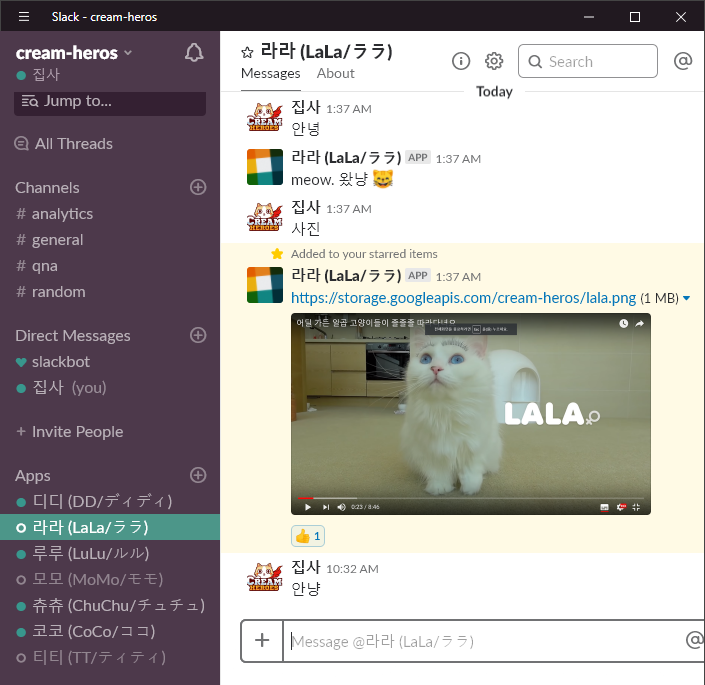
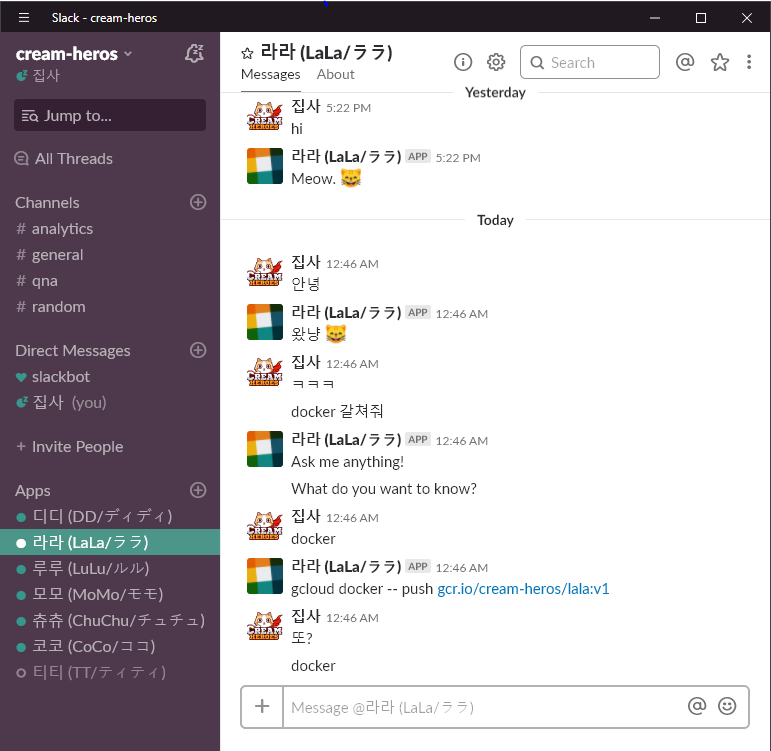

# Kubernetes로 칠냥이 도커 컨테이너에서 키우기

## 오마쥬 크림 히어로즈

이 프로젝트는 [QwikLab - Build a Slack Bot with Node.js on Kubernetes](https://qwiklabs.com/focuses/635?parent=catalog)에서 소개하고 있는 [Google Codelab](https://github.com/googlecodelabs/cloud-slack-bot.git)을 응용한 것으로 고양이 슬랙봇 일곱 마리를 도커 컨테이너에 담아 키워보는 구글 클라우드 챌린지를 만들어보았습니다.

원본 kitten bot 예제 코드에서는 새끼 고양이 한 마리만 등장하지만 고양이가 외로울 수 있기 때문에 유명한 유튜브 채널인 [크림 히어로즈](https://www.youtube.com/channel/UCmLiSrat4HW2k07ahKEJo4w)에서 처럼 행복한 일곱 냥이를 키워보고 싶었습니다.

## 고양이 파악하기

kitten bot에 고양이의 특징을 반영하기 위해 먼저 냥이들의 특징을 분석해봅니다.

* hi 라고 인사하면 모든 고양이가 meow라고 인사해줍니다.
* dd 라고 부르면 고양이 디디가 자기 이름인 것을 알아듣고 meow라고 인사해줍니다.
* tt 라고 부르면 티티가 달려와서 meow라고 인사해줍니다.
* 고양이들은 아침 8시에 일어나서 12시에 잡니다.
* 디디는 모닝콜을 해 줍니다.


## 클라우드 챌린지

* 티티,디디,코코,모모,츄츄,라라를 어떻게 컨테이너에 태울 것인가?
* pod는 어떻게 구성해야하나?
* 냥이 시간 맞춰 재우기/깨우기/밥주기

## 슬랙 채널 만들기

크림 히어로즈 집사가 모시고 있는 고양이는 총 7마리 입니다. 이름은 [나무 위키-크림 히어로즈](https://namu.wiki/w/크림히어로즈)에 소개된 내용 그대로 사용하겠습니다.

> 디디 \(DD/ディディ\) @dd 티티 \(TT/ティティ\) @tt 코코 \(CoCo/ココ\) @coco 모모 \(MoMo/モモ\) @momo 츄츄 \(ChuChu/チュチュ\) @chuchu 루루 \(LuLu/ルル\) @lulu 라라 \(LaLa/ララ\) @lala

귀여운 냥이들과 대화하기 위해서는 내 슬랙 채널을 하나 만들어서 모셔와야 합니다. 봇 일곱개를 만들어 설치하고 토큰 일곱개를 미리 잘 챙겨둡니다. 토큰이 저장된 개별 파일 또는 디렉토리는 .gitignore에 등록하셔서 토큰이 유출되지 않도록 해 주세요. 내 토큰은 소중하니까요.

```text
$ mkdir secret
$ echo "[슬랙 토큰 문자열]" > dd-token
$ DD_TOKEN_PATH=./secret/dd-token node ./dd/dd.js # 테스트용
```

## 코드 준비

구글 클라우드에서 project를 생성하고 cloud console에서 [copycat.sh](https://github.com/goungoun/cream-heros/tree/bffc5e3ca301a7faae0042b98759db3c58cc8b8a/copycat.sh)을 실행하여 칠냥이와 관련한 모든 파일을 만들어줍니다. 저는 cream-heros 프로젝트에서 실행하였지만 직접 실습해보시는 경우는 해당 project\_id로 인식해주는 작업이 필요하기 때문에 반드시 한번은 스크립트를 돌려서 각 설정들을 맞춰줘야 합니다.

```bash
$ git clone https://github.com/goungoun/cream-heros.git
$ chmod +x ./copycat.sh
$ ./copycat.sh dd tt coco momo chuchu lulu lala
```

package.json은 npm init으로 만들수도 있지만 여기서는 그냥 복사한 것을 사용하겠습니다.

```bash
$ npm init
$ npm install --save botkit
```

## 버켓에 고양이 사진 올리기

Storage &gt; bucket을 생성하여 고양이 사진을 올려줍니다. 이 사진은 채팅창에 '사진' 이라고 입력하면 사진을 보여주는 용도로 사용할 것입니다.  
   
 올린 사진을 외부에 오픈하기 위해서는 권한 수정에서 allUsers 그룹을 만들어서 읽기 권한을 줍니다.

```text
Entity: Group
Name: allUsers
Access: Reader
```

이 작업을 해 주어야 이렇게 외부에서 접근 가능한 짧은 URL이 제공됩니다. [https://storage.googleapis.com/cream-heros/container\_capsule.png](https://storage.googleapis.com/cream-heros/container_capsule.png)

구글 클라우드에 처음 사진을 올리시는 분은 [Extract, Analyze, and Translate Text from Images with the Cloud ML APIs ](https://qwiklabs.com/focuses/1836?parent=catalog)에 Upload an image to a cloud storage bucket을 참고하시면 됩니다.

## 도커 빌드

도커 이미지를 만들어서 gcr.io 구글 클라우드의 레지스트리로 push 해 줍니다. docker build 커맨드를 사용하여 디디의 도커 이미지를 만들어줍니다.

```bash
$ docker build -t gcr.io/cream-heros/dd:v1 .
$ docker images
$ gcloud docker -- push gcr.io/cream-heros/dd:v1
$ docker rmi ${IMAGE_ID} # 잘못 만들어서 이미지 삭제가 필요할 때
```

도커 이미지를 push 해 준 다음에는 Container Registry 메뉴에서 확인할 수 있습니다.

## 도커 실행 테스트

도커 이미지에는 토큰 파일이 들어있지 않기 때문에 현재 디렉토리에 있는 토큰 파일을 도커와 volume과 연결시켜주어야 합니다. 현재 디렉토리의 dd.token를 도커가 읽어갈 수 있도록 volume을 매핑해주고 도커 내 환경변수에 토큰 파일을 설정하여줍니다.

```bash
$ docker run -d \
   -v $(pwd)/secret/:/secret \
   -e DD_TOKEN_PATH=/secret/dd-token \
   gcr.io/cream-heros/dd:v1
$ docker ps
$ docker stop ${CONTAINER ID}
```

## TOKEN

Kubernetes &gt; 구성 메뉴로 들어가면 비밀번호, 키, 토큰과 같은 민감한 정보를 저장할 수 있는 공간이 있습니다. 슬랙 토큰은 소스코드에 기록하게되면 유출의 염려가 있기 때문에 별도의 파일에 기록한 다음 쿠버네티스 클러스터에 적용해줍니다. 토큰의 이름은 \_를 사용할 수 없는 것에 유의해주세요.

```bash
$ kubectl create secret generic dd-token --from-file=./secret/dd-token
$ kubectl get secret
NAME                  TYPE                                  DATA      AGE
dd-token              Opaque                                1         2m
default-token-qtqm8   kubernetes.io/service-account-token   3         27m
```

나머지 여섯 냥이의 토큰도 빈 파일을 미리 만들어놓고 코드편집기\(베타\)를 활용해서 넣어줍니다.

```bash
$ touch tt-token momo-token lulu-token lala-token chuchu-token coco-token
```

그리고 kubectl create 명령어를 고양이 수 만큼 일곱 번 실행해주는데 저는 뭔가 잘못 써서 토큰이 바뀌는 바람에 dd를 부르면 tt가 응답하고 tt가 dd로 응답하는 실수를 저질렀네요. 바로 swap하여 고쳐주었습니다.

```text
$ cat dd-token > bak-token
$ cat tt-token > dd-token
$ cat bak-token > tt-token
```

하지만 반복되는 실수가 싫으니까 스크립트도 하나 만들어봅니다. secret 하위 디렉토리의 파일들을 읽어서 시크릿을 등록해주는 스크립트입니다. [./secret.sh](https://github.com/goungoun/cream-heros/tree/bffc5e3ca301a7faae0042b98759db3c58cc8b8a/secret.sh)을 1회 실행해줍니다. 혹시라도 나중에 클러스터를 삭제했다가 재 생성하는 경우에 이 스크립트를 사용할 수 있습니다.

```bash
#!/bin/bash
for cat in `ls ./secret`;do
  kubectl create secret generic ${cat} --from-file=./secret/${cat}
done

kubectl get secret
```

```bash
$ kubectl get secret
NAME                  TYPE                                  DATA      AGE
chuchu-token          Opaque                                1         15s
coco-token            Opaque                                1         9s
dd-token              Opaque                                1         30m
default-token-bz9c5   kubernetes.io/service-account-token   3         38m
lala-token            Opaque                                1         20s
lulu-token            Opaque                                1         25s
momo-token            Opaque                                1         32s
tt-token              Opaque                                1         45s
```

## 쿠버네티스

Kubernetes Engine &gt; Kubernetes clusters &gt; Create cluster로 만들거나 gcloud container clusters 커맨드로 디디를 위한 클러스터를 만들어줍니다. 노드는 나중에 늘려줄 수 있기 때문에 일곱냥이를 다 태워줄수 있을지 없을지는 고민하지 마세요.

```bash
$ gcloud container clusters create dd-cluster \
      --num-nodes=2 \
      --zone=us-central1-f \
      --machine-type n1-standard-1
$ gcloud compute instances list
```

이렇게 생성한 클러스터는 [Kubernetes doc](https://kubernetes.io/docs/concepts/workloads/controllers/deployment/)을 참고하여 kebectl 명령어로 확인해봅니다.

```bash
$ kubectl get services
$ kubectl get deployments
$ kubectl get rs
$ kubectl get pods
$ kubectl describe deployments
$ kubectl logs ${POD_NAME} ${CONTAINER_NAME}
```

```bash
$ kubectl create -f ./dd/deploy.yaml
```

동일한 방법으로 tt, momo, lala, chuchu, lulu 도커 이미지도 배포해줍니다. 

```bash
$ kubectl delete -f ./dd/deploy.yaml //yaml 파일이 있을 때
$ kubectl delete deployment dd //yaml 파일이 없을 때 <resource> <name>
```

## POD

쿠버네티스의 POD는 어드민과 네트워킹을 하기 위해 묶어놓은 그룹입니다. 하나 또는 여러개의 컨테이너를 포함할 수 있고 kubectl run 커맨드로 pod를 만들 수 있습니다.

* 하나의 컨테이너로 POD 만들기 - 털 뚠뚠이 디디가 컨테이너에? 심쿵!!

  

  ```bash
  $ kubectl create -f ./dd/deploy.yaml --record
  ```

* 여러개 컨테이너로 POD 만들기 - 일곱냥이 모두 컨테이너에 들어가는 것을 좋아합니다.  [영상 보러가기 ♡♡](https://www.youtube.com/watch?v=bGvsqQW1XOw)

  

  ```bash
  $ gcloud docker -- push gcr.io/cream-heros/tt:v1
  $ kubectl create -f ./tt/deploy.yaml --record
  ```

## 아니, 디디가 한국어를 알아들어?

디디가 한국어를 알아들을 수 있게 [./dd/kitten.js](https://github.com/goungoun/cream-heros/tree/bffc5e3ca301a7faae0042b98759db3c58cc8b8a/kitten.js)를 살짝 수정해봅니다.

```bash
controller.hears(
  ['hello', 'hi', 'dd', '안녕'], ['direct_message', 'direct_mention', 'mention'],
  function (bot, message) { bot.reply(message, 'Meow. :smile_cat:') })
```

그리고 새로운 태그를 붙인 이미지를 배포합니다.

```bash
$ docker build -t gcr.io/cream-heros/dd:v1_1 .
$ docker images
$ gcloud docker -- push gcr.io/cream-heros/dd:v1_1
```

## 라라는 똑똑하니까

라라는 칠냥이 중에서 제일 똑똑합니다. 크림 히어로즈 [누가 제일 똑똑할까? 고양이 IQ 테스트편 ](https://www.youtube.com/watch?v=jp9liXE_1wc)에서 검증되었지요. 제가 도커나 쿠버네티스 커맨드를 아직 다 못 외워서 맨날 찾아보는데 제 선생님으로 모실까 해요.



[https://botkit.ai](https://botkit.ai)를 보시면 생각보다 쉽게 추가가 가능한 것을 알 수 있습니다. [./lala/kitten.js](https://github.com/goungoun/cream-heros/tree/bffc5e3ca301a7faae0042b98759db3c58cc8b8a/lala/kitten.js)은 controller.hears 로 시작하는 코드블럭을 뒤에 계속 추가하는 구조로 확장하고 있습니다.

